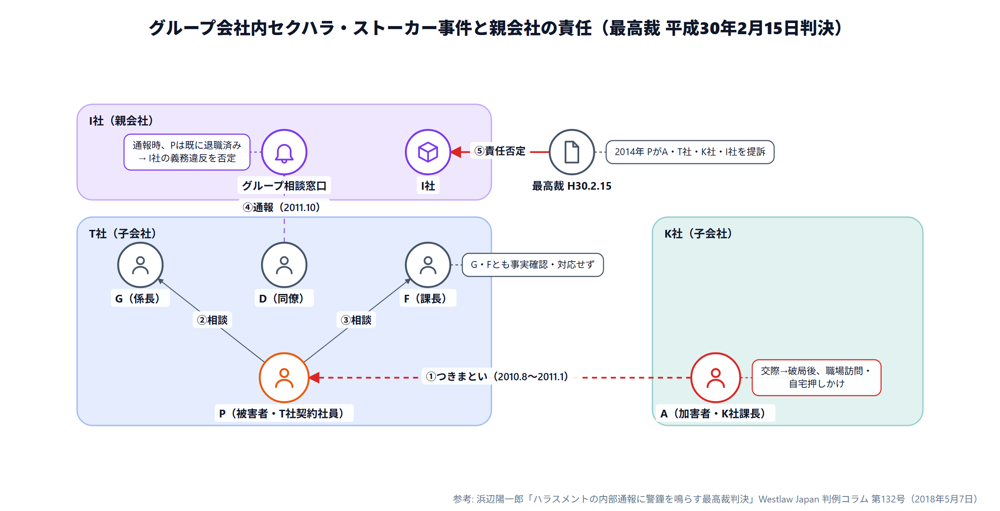

# RelaGrid

グリッドにアイコンのノードを置き、矢印でつないで関係図を作るエディタです。
マウスで描く方法と、短いテキスト（DSL）で書く方法があり、両者は常に同期します。
[Gridgram](https://gridgram.ideamans.com/) のようなデザインを、ブラウザだけで完結する
静的Webアプリとして実装しています（サーバー・ビルド不要、外部依存ライブラリなし）。

- **使ってみる**: [minnanosaiban.github.io/relagrid](https://minnanosaiban.github.io/relagrid/)
- **技術解説**: [仕組みと設計の解説](https://minnanosaiban.github.io/tomo/tech/relagrid/)（データの流れ、入力の検証、デザインシステム）



## 特長

- **GUIとテキストの双方向編集**: ツールバーで 選択 / ノード / 接続 / ゾーン / ノート を切り替えてキャンバス上で作図。テキスト（DSL）を書いても、GUIで編集しても、もう一方に反映される
- ノード・接続線・色付きゾーン・注釈ノート、38種類のアイコン、9色パレット
- ライト/ダークテーマ、Undo/Redo
- SVG / PNG / PNG 縦(4:5) / PNG(16:9) / JSON / テキストへの書き出し、JSON・テキストの読み込み
- **図はブラウザの外に出ません**: 処理はすべてブラウザ内で行い、外部への通信もありません。ブラウザの localStorage に自動保存します
- AIにDSLを書かせて貼り付ける使い方に対応（下記）

## 使い方

公開ページを開くだけで使えます。インストールは不要です。

`index.html` をブラウザで直接開いても動作します（ビルド不要）。
ローカルでサーバー経由で試す場合:

```bash
python -m http.server 8000
```

その後 `http://localhost:8000/` を開きます。

### 操作

| 操作 | 方法 |
|---|---|
| ノードを置く | 「ノード」ツールで、空いているマスをクリック |
| ノードを動かす | 「選択」ツールで、ノードを別のマスへドラッグ |
| つなぐ | 「接続」ツールで、起点 → 終点の順にノードをクリック（Esc で取り消し） |
| ゾーンを作る | 「ゾーン」ツールで、マスをドラッグして範囲を選ぶ |
| ノートを付ける | 「ノート」ツールで、ノードをクリック |
| 編集する | 要素をクリックすると、右のインスペクタで編集できる |
| 削除する | 選択して Delete / Backspace |
| 元に戻す / やり直す | Ctrl+Z / Ctrl+Shift+Z（または Ctrl+Y） |

## AIと組み合わせて作る

アプリ右上の「? AIを利用する方法」を開くと、AI用のプロンプトがコピーできます。
手順は次のとおりです。

1. プロンプトをコピーし、「【内容】」の下に作りたい関係図の説明を書き足してからAIに送る
2. AIが返したDSLコード（&#96;&#96;&#96;で囲まれた部分）をコピーする
3. 画面左端の「▶ テキスト (DSL)」をクリックして欄を開き、そこに貼り付ける（図がその場で描画される）

プロンプトにはDSL構文をすべて含めているので、AIがこのサイトを閲覧できなくても
正しい記法で書けます。API連携やログインは不要です。

記法に誤りがあると、ステータスバーに行番号つきでエラーが出ます。
エラーの行をAIに貼り戻して直させることもできます。

## DSL構文

```
grid 4x3                 # 列x行のグリッドサイズ
theme dark                # light | dark (省略時 light)
title "図のタイトル"        # 上部に表示（任意）。長いと自動で折り返し、\n で改行も指定できる
textscale 1.3             # 文字の倍率 0.6〜2.5（省略時 1）。縦画像向けに大きくする
source "参考: ○○ 判例コラム" # 右下に小さく表示（任意）

zone A1:B2 "Public zone" color=blue
node api B1 icon=server size=1.2 color=blue "API"
node user1 A1 icon=user "利用者"   # IDは半角英数字。日本語は "ラベル" に書く

api -> db "SQL"            # ->  単方向
api <-> cache "sync"       # <-> 双方向 / <- 逆方向 / -- 矢印なし
api -> db "SQL" style=dashed color=red width=2

note api "SLA 99.95%\np99<200ms" pos=bottom

# 行頭の # はコメント
```

アイコン名の例: `user` `users` `laptop` `mobile` `browser` `server` `database`
`cloud` `globe` `wifi` `plug` `queue` `gear` `cpu` `disk` `lock` `unlock`
`shield` `mail` `bell` `clock` `bolt` `refresh` `chart` `folder` `file`
`card` `pin` `search` `filter` `link` `git` `code` `terminal` `check`
`x` `warning` `plus` `box`

色名: `slate`（既定） `blue` `green` `red` `orange` `purple` `teal` `pink` `yellow`

### 記述の決まり

**ノードID**（`node` の直後に書く名前。接続・ノートから参照されます）

- 使える文字は半角の英数字・`_`・`-` のみ。先頭は英字か `_`（例: `api` `db_1` `web-2`）
- 日本語・空白・`=` などは使えません。日本語の名前は `"ラベル"` に書きます

  ```
  node plaintiff A1 icon=user "原告"      # OK: IDは plaintiff、表示は「原告」
  node 原告 A1 icon=user                  # NG: IDに日本語は使えない
  ```

- `grid` `theme` `title` `textscale` `source` `zone` `node` `note` は行の先頭に使う語なので、IDにできません
- 同じIDは重複不可（エラー）。GUIの「ID」欄も同じ規則で検証されます

**そのほか**

- グリッドサイズは 1〜26列 × 1〜30行です（範囲外はエラー）
- 1つのマスに置けるノードは1つです（重複は警告）。グリッド外の座標も警告になります
- 文字列内の `"` と `\` は `\"` `\\` のようにバックスラッシュでエスケープします（GUIで編集した場合は自動）
- 未知のアイコン名・色名・線種・向きは警告になり、既定値（`box` / `slate` / `solid` / `right`）で描かれます

エラーは行ごとに画面下部のステータスバーに表示され、エラーがある間は直前の図が保たれます。

GUIで編集すると、テキストは自動的にこの記法へ整形されます（手書きのコメントは保持されません）。

## 書き出し

| 形式 | 用途 |
|---|---|
| SVG | 拡大しても劣化しない。ほかのソフトで編集できる |
| PNG | そのままのサイズ（2倍の解像度） |
| PNG 16:9 | スライド向け。短い辺に余白を足して 16:9 にそろえる |
| PNG 縦（4:5） | Xなどの縦画像向け |
| JSON / テキスト | 図そのもの。読み込みで復元できる |

### Xなどに縦画像で投稿する

横長の図は、X（旧Twitter）のタイムラインで縮小されると文字が小さくなりすぎます。次の方法で縦長の図にできます。

1. グリッドを3列前後に絞って縦に並べる（サンプル「…縦版・X投稿用」が例）
2. `textscale 1.3` のように文字倍率を上げる
3. 書き出しは「PNG 縦」を使う（縦長のまま書き出す。4:5より横長の図だけ上下に余白を足して4:5にそろえる）

## 開発

ビルド工程はありません。ファイルを編集して、ブラウザで開くだけです。

```
index.html
css/style.css
js/
  icons.js       アイコン素材（オリジナル・依存なし）
  colors.js      配色パレット
  model.js       データモデル / グリッド参照ヘルパー
  parser.js      DSLテキスト -> モデル
  serializer.js  モデル -> DSLテキスト
  renderer.js    モデル -> SVG描画
  samples.js     サンプル図
  app.js         GUI操作・状態管理・書き出し
tests/run.js     パーサ・シリアライザの回帰テスト
examples/        技術解説ページの図の元データ（DSL）
exports/         サンプル図の書き出し画像（このREADMEの画像など）
```

読み込み順（`index.html` の `<script>`）が、そのまま依存関係です。
ES Modules は使わず、`window.RelaGrid` に機能を載せています。

### テスト

パーサ・シリアライザの回帰テストです（Node.js のみ、依存なし）。

```bash
node tests/run.js
```

### 公開

GitHub Pages（`main` ブランチ）で公開しています。`main` に push すると、1分ほどで公開ページに反映されます。
`deploy.bat` をダブルクリックすると、変更の一覧を確認してから、commit と push を行います。

自分のリポジトリで公開する場合は、Settings → Pages → Source を
「Deploy from a branch」「main」に設定してください。

JS・CSS を変えたときは、`index.html` の `?v=` の数字を上げてください
（ブラウザのキャッシュで古いファイルが読まれるのを避けるため）。

## 既知の制約

- 接続線は直線のみです（直交ルーティング未対応）。途中のノードの上を通る線や、重なる線が出ることがあります
- GUI操作のたびにテキストは正規形へ整形されるため、独自フォーマットやコメントは保持されません
- サーバー保存・共有機能はありません（ブラウザ内で完結する設計のため）。大事な図は JSON かテキストで書き出してください
- ブラウザのデータを消すと、自動保存した図も消えます
